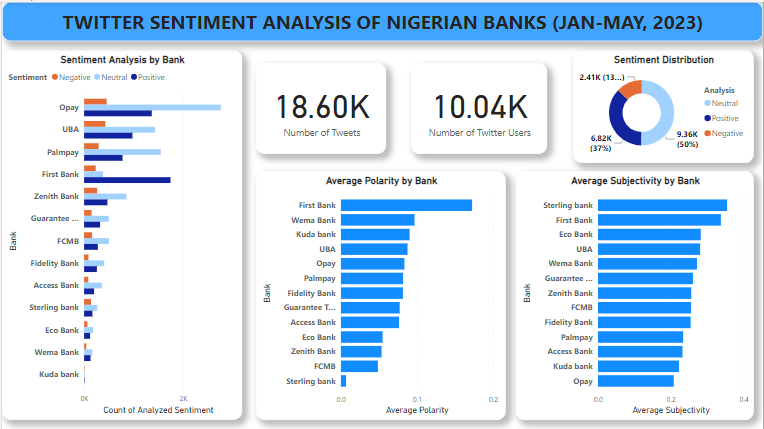

# Twitter Sentiment Analysis of Nigerian Banks
## Introduction
The banking industry in Nigeria is the most digitized on the continent, and the nation was recently named the leader in digital payments in Africa. A [press release](https://www.businesswire.com/news/home/20220719005265/en/) from 2022 states that Nigeria recorded 3.7 billion real-time payments in 2021, placing it sixth among nations with the largest real-time payments markets.
However, due to high inflation, rising interest rates, shortage of US dollars, regulatory interference, and shortage of the Naira notes before the general election in February, weakens bank operating conditions in 2023.

## Aims and Objectives
This project aims to uncover insights in from bank customers' tweets on Twitter.com. To see how the banks' online customers perceive or react to the respective banks' services.

## Process Methodology
- **Data Collection**: A python library called Snscrape is used to scrape tweets from Twitter, while pandas is used to read in the scraped data. The data collected are tweets of contains banks name from january to May, 2023.
- **Data Cleaning and Preprocessing**: The libraries used are pandas (for data cleaning and analysis), textblob (for sentiment analysis), and nltk (natural processing language toolkit). Tweets that contains phrase like "thank you for contacting", "thanks for contacting", "sorry your message is yet to be responded" and more were removed from the dataframe to ensure tweets are basically for bank customers.
-  **Sentiment Analysis**: The tweets' polarity was determined using the TextBlob library. Polarity has a scale from -1 to 1, with a score below 0 being considered **negative**, 0 being considered **neutral**, and a score above 0 being considered **positive**.  On the other hand, subjectivity gauges the intensity of each tweet's emotions. These ratings reflect the general opinion expressed by twitter users about Nigerian banks.
- **Exploratory Data Analysis/Visualization** : Text mining and data wrangling were used in this stage to extract pertinent data and information and produce insightful findings. In order to make the results easier to understand, visualizations were created.

## Data Visualization

## Insights
- 18,600 tweets were used for this analysis.
- 10,040 Twitter users contributed to the tweets.
- The Sentiment Distribution chart shows that 50% of the tweets are neutral, 37% are postive and 13% negative.
- Virtually all the banks has lower negative polarity compared to their respective postive and  neutral polarities.
- FirstBank has the highest positive polarity ratio, while Opay has the highest neutral polarity ratio. 
- FirstBank still maintains the highest in the average polarity rating, followed by Wema Bank and Kuda. This indicates that most tweets about these banks reflects good remarks about their services. 
- Meanwhile, Sterling stay at the bottom of the rating with very litle average polarity.
- Subjectivity which shows the amount of emotion in each tweets shows that Sterling, FirstBank and Eco Bank are the top of the chart. Although, the difference in the ranks of each bank is not much.
